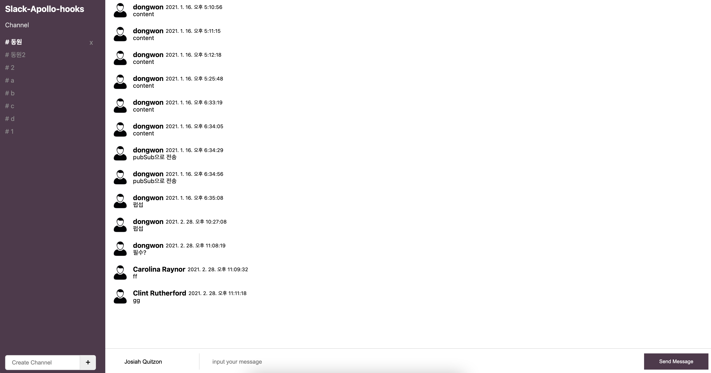

# Slack Clone 코딩

- Server : NodeJS + postgreSQL
- Client : React + TypeScript, GraphQL, Context API
- etc : pubsub, styled-component, Graphql-yoga

Slack Clone 코딩으로 GraphQL을 공부하기 위해 개발하였으며 Server는 Node, Client는 React+Graphql을 통해 개발하였습니다. Client는 CRA를 통해 개발하였어서 Webpack공부와 TS공부를 위해 Cra없이 TS를 통해 개발중에 있습니다.

Slack 채널 조회, 생성과 삭제, (수정은 서버만 세팅) 빠른 채팅을 위한 pubsub으로 개발하였습니다. Graphql-yoga를 통해 서버를 구성하고 postgreSQL를 통해 db를 구성하였습니다.

GraphQL api 호출과 mutation, subscription을 통해 개발하였고 css는 styled-component를 사용하였습니다. 상태관리로는 Context API를 사용하였습니다.

